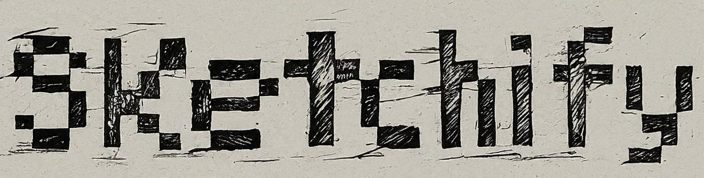

# SKETCHIFY

<!-- PROJECT LOGO -->
<!-- markdownlint-disable -->
<div align="center" style="margin-top: 24px">
  
  <h3 align="center">A server application to train Gemini, FastAPI, OpenCV, Postman and Image manipulation.</h3>
</div>
<!-- markdownlint-disable -->

## MOTIVATION

Sketchify is a POC based at [Codewithcurious](https://codewithcurious.com/python-projects/convert-image-into-sketch-python/) that allows me to explore this area by building a tool that converts images into sketches. It's a great way to gain practical experience with Python's image manipulation capabilities.

## SETUP

### Create a virtual environment

```shell
# with default
python -m venv .venv
# with specific version
python3.6 -m venv .venv
```

### Activate the .venv

```shell
source .venv/Scripts/activate
```

### Install all needed packages

```shell
pip install -r requirements.txt
```

## RUN THE SERVER

```shell
uvicorn main:app --reload
```

## DOCS

[Redoc](http://127.0.0.1:8000/redoc)  
[Swagger](http://127.0.0.1:8000/docs)

## FINAL CONSIDERATIONS

This application is a practice project built to explore technologies and concepts. It's not intended for commercial use and may not adhere to best practices for production environments.
Feel free to explore, contribute, or provide feedback. Thank you for checking it out!
